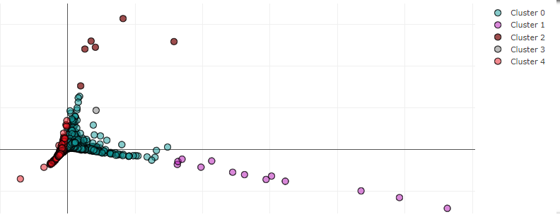

# Cryptos and Stocks Risk Assessments
risk-assessor is a tool that provides you with some of the basic risks and returns features investors look for when analyzing certain stocks and crypto assets.

### Project Details:
#### Purpose
I built this project with the objective of finding a way to look at different common risk and return factors in crypto assets and stocks while looking to see how stocks would group in together with different cryptos through a clustering analysis.

#### Data
- Nasdaq.com
- Coinmetrics.io API 
- Quandl.com API

### Installation
* Installation of Anaconda
* pip install python packages seen on first cell of code file
* Clone repository to computer
* Acces through jupyter notebook
* Update code to your own file paths

### Cluster
